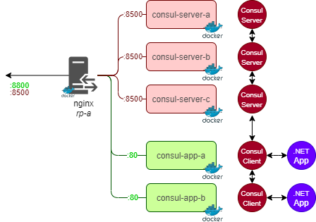

# Ocelot-DC

This repo contains a demonstration Ocelot Datacenter setup using Docker Containers. The objective is to demonstrate the "right" setup. Using a Postman collection it demonstrate how we can query service/node informations over the Consul API.

# Setup

## Prerequisites
- Docker Desktop (Windows or Linux)
- A .NET Core DEV environment (Visual Studio, Visual Studio Code, `dotnet-CLI`)

## Bring it to work
- Build the container images
- Run the `docker-compose` to start the datacenter
- Check for Consul Datacenter sanity

### Build the container images
Open a Terminal in root directory of the repo

Build the .NET Core app

```.\deploy\Build-Container.ps1 -BuildTarget app```

Build the Consul Server

```.\deploy\Build-Container.ps1 -BuildTarget consul-server```

Build the Consul App

```.\deploy\Build-Container.ps1 -BuildTarget consul-app```

### Run the Datacenter

```docker-compose -f .\deploy\docker\docker-compose.yml up -d```

### Sanity checks
Check that the datacenter

#### Docker Container status
```docker ps```
#### Consul Datacenter
Open the <http://localhost:8500/> within your favorite browser

#### Application
Open the either <http://localhost:8800/weatherforecast> or <http://localhost:8800/health> within your favorite browser

## Clean-up

```docker-compose -f .\deploy\docker\docker-compose.yml down```
# Architecture



# Operations

You can see on the Consul UI that the application register itself into the datacenter and expose an `health` endpoint used by consul to monitor the service.

The `health` endpoint can be configured to return either `http-200` or `http-500` to simulate a break-down.

To do so, using a REST-Client, post the following request:

```
curl -X POST http://localhost:8801/health/set/true -v -d ""
```

The above request will make the cosul-app-a to fail.

Further API requests, among others against the Consul API, can be found within the Postman collection under `test/postman` directory.